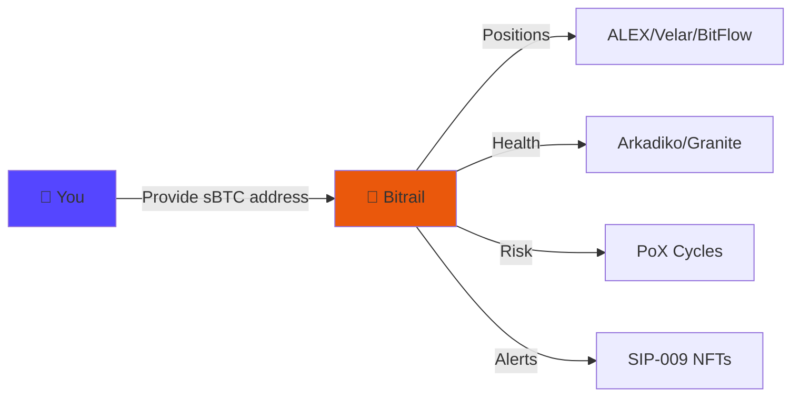
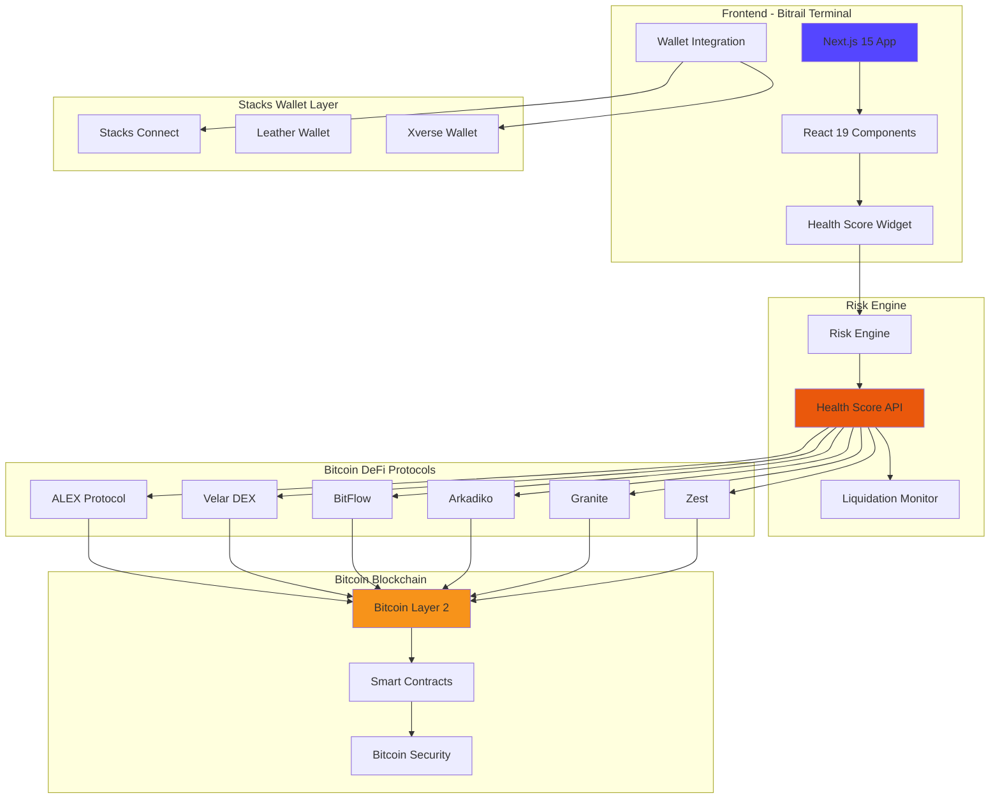
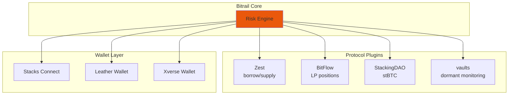
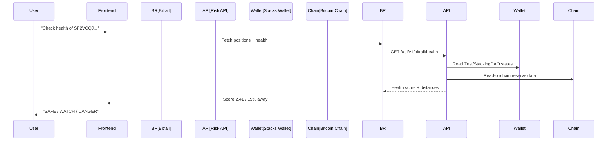
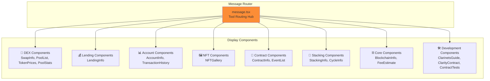

# Bitrail — Risk Rails for Bitcoin on Stacks


## Overview

Cross-protocol position monitoring, health scoring, and guarded capital routing for sBTC, stBTC, and Zest positions.

## Risk Model

healthFactor = totalCollateralUSD / (totalDebtUSD / liquidationThreshold)

- healthFactor > 1.5 → SAFE (green)
- healthFactor 1.0–1.5 → WATCH (yellow)
- healthFactor < 1.0 → DANGER (red) — liquidatable

Liquidation Distance: distancePct = ((healthFactor - 1.0) / healthFactor) * 100

Bitrail gives users and protocols a shared cross-protocol view of position health, liquidation distance, and safe rebalancing — so Bitcoin capital can move deeper into the Stacks ecosystem without opaque risk.

Not a DEX. Not a lending protocol. Not a yield farm. Not a portfolio tracker.
It is infrastructure: risk intelligence + policy-constrained routing that other Stacks apps can integrate.

Part of the **Bitrail** grant - Stacks Endowment Q3 2026, Theme: "Put the Rails to Work"

[](https://nextjs.org/)
[](https://react.dev/)
[](https://www.typescriptlang.org/)
[](https://www.stacks.co/)
[](#protocol-integrations)

---

## Table of Contents

- [Overview](#overview)
- [Features](#features)
  - [AI-Powered Bitcoin DeFi](#ai-powered-bitcoin-defi)
  - [DeFi Protocol Operations](#defi-protocol-operations)
- [Architecture](#architecture)
  - [System Overview](#system-overview)
  - [MCP Plugin Architecture](#mcp-plugin-architecture)
  - [Data Flow](#data-flow)
- [Protocol Integrations](#protocol-integrations)
- [Technology Stack](#technology-stack)
- [Quick Start](#quick-start)
- [Usage Examples](#usage-examples)
- [Component Architecture](#component-architecture)
- [Security Considerations](#security-considerations)
- [Contributing](#contributing)

---

## Overview

**100+ operations. 8+ protocols. 1 conversation.**



**We've built what everyone else is promising:**
- 100+ live Bitcoin DeFi operations (not promises)
- Natural language access to ALEX, Velar, BitFlow, Charisma, Arkadiko, Granite
- Real-time AI streaming with live blockchain data
- Native Bitcoin security with Stacks Proof of Transfer

## Architecture

### System Overview




### MCP Plugin Architecture



### Data Flow



## Features

### Risk Intelligence
- **Cross-Protocol Position Health**: Monitor Zest, StackingDAO, Bitflow, and wallet positions in one view
- **Health Factor Calculation**: `totalCollateralUSD / (totalDebtUSD / liquidationThreshold)` 
- **Liquidation Distance**: Percentage and USD/BTC distance to liquidation
- **Per-Assumption Disclosure**: All assumptions visible in UI accordion

### Dashboard Portfolio
- Connect Leather / Xverse wallet
- Render: HealthScoreWidget + PositionsList + AlertsSummary
- API calls: GET /api/v1/bitrail/health/{address}, GET /api/v1/bitrail/positions/{address}

### Health Score Widget
- Large health factor number (e.g. "2.41")
- Status badge: SAFE / WATCH / DANGER (colored)
- Liquidation distance: "X% away | $X | X BTC"
- Collateral: $X vs Debt: $X
- Assumptions disclosure toggle (accordion showing risk model assumptions)
- "Model: bitrail-risk-v0.1" label
- Last updated timestamp

### Positions Table
- Protocol | Asset | Type | Balance (token) | Value (USD) | Value (BTC)
- Group rows by protocol (Zest section, StackingDAO section, Wallet section)
- Type badges: collateral=blue, debt=red, liquid=green, lp=purple
- Empty state: "No positions found. Connect a wallet with Zest or StackingDAO positions."
- Show total row at bottom

### Alerts
- User-set thresholds for health factor monitoring
- Fire when threshold crossed (in-app + webhook only for MVP)
- Create alert via UI form

### Guarded Actions
- "Guarded Repay on Zest" - only execute if post-check health ≥ policy minimum
- Show clear disclaimer: "Not financial advice. Verify on-chain before signing."
- Router fails closed: if health check fails, no action executes

## Technology Stack

### Core Framework
- **Next.js 15**: Modern React framework with App Router architecture
- **React 19 RC**: Latest React features with concurrent rendering
- **TypeScript 5.6**: Enhanced type safety and developer experience
- **Tailwind CSS 3.4**: Responsive utility-first styling system

### AI & Data Processing
- **Vercel AI SDK 5.0**: Advanced AI integration with streaming capabilities
- **OpenAI GPT**: Fine-tuned models for Bitcoin DeFi domain expertise
- **MCP Server**: Model Context Protocol for blockchain operations
- **Streaming APIs**: Real-time data processing and response generation

### Blockchain Integration
- **@stacks/connect**: Official Stacks wallet connection library
- **Leather Wallet**: Primary wallet for Stacks ecosystem
- **Xverse Wallet**: Alternative wallet with Bitcoin and Stacks support
- **Clarity SDK**: Smart contract interaction with Clarity language

### Database & Storage
- **Drizzle ORM 0.34**: Type-safe database operations
- **Better SQLite3**: High-performance local database
- **Vercel Postgres**: Scalable cloud database option
- **Vercel Blob Storage**: File and asset management

## Quick Start

### Prerequisites
- Node.js 18 or higher
- pnpm package manager
- Stacks wallet (Leather or Xverse)
- Running MCP server instance
- Environment variables configured

### Installation

1. **Clone and install dependencies**
   ```bash
   git clone <repository-url>
   cd vechain-terminal-frontend
   pnpm install
   ```

2. **Configure environment variables**
   ```bash
   cp .env.example .env.local
   ```
   Edit `.env.local` with your API keys and configuration:
   ```env
   OPENAI_API_KEY=your_openai_api_key
   STACKS_NETWORK=testnet
   MCP_SERVER_URL=http://localhost:3000
   DATABASE_URL=your_database_url
   ```

3. **Initialize database**
   ```bash
   pnpm db:generate
   pnpm db:migrate
   ```

4. **Start development server**
   ```bash
   pnpm dev
   ```

   The application will be available at `http://localhost:3000`

## Usage Examples

### DEX Trading
```
"Swap 100 STX for ALEX on ALEX Protocol"
"Show me all liquidity pools on Velar"
"What's the current price of sBTC?"
"Find the best route to swap USDA for ALEX with minimal slippage"
```

### Lending Operations
```
"Borrow 1000 USDA from Arkadiko using STX as collateral"  # Mainnet only
"Check my health factor on Granite"
"Deposit 500 STX into Arkadiko vault"  # Mainnet only
"What's the current APY for lending sBTC on Granite?"
```

**Note**: Arkadiko operations require **mainnet** connection. For testing lending protocols on testnet, use Granite Finance instead.

### Stacking (PoX)
```
"Stack 10,000 STX for Bitcoin rewards"
"How much Bitcoin can I earn by stacking?"
"Check my current stacking status"
"Delegate my STX to a stacking pool"
```

### Token & NFT Operations
```
"Show me my STX balance and all tokens"
"Check my NFT collections"
"Transfer 50 ALEX tokens to SP2..."
"What SIP-010 tokens do I hold?"
```

### Smart Contract Development
```
"Create a new Clarinet project for an NFT marketplace"
"Generate a SIP-010 fungible token contract called MyToken"
"Generate unit tests for my counter contract"
"Show me how to configure for testnet deployment"
```

## Component Architecture

### UI Component Structure



All components follow a consistent three-state pattern:

1. **Loading State**: Skeleton loaders with pulsing animation
2. **Error State**: Descriptive error messages in red cards
3. **Success State**: Clean, organized data display

## Security Considerations

### Wallet Security
- Client-side wallet integration with @stacks/connect
- No private key storage on servers
- Secure transaction signing through Leather/Xverse wallets
- Network isolation between testnet and mainnet

### Transaction Security
- User confirmation required for all write operations
- Clear transaction details displayed before signing
- Gas estimation and fee calculation
- Transaction status tracking and confirmation

### API Security
- Environment variable protection for API keys
- Rate limiting on external API calls
- Input validation and sanitization
- HTTPS-only communication

## Contributing

This project welcomes contributions for improving Bitcoin DeFi accessibility:

1. Fork the repository and create feature branches
2. Follow TypeScript and React best practices
3. Add comprehensive tests for new functionality
4. Update documentation for UI/UX changes
5. Submit pull requests with detailed descriptions

## License

MIT License - see LICENSE file for complete terms and conditions.

---

## Summary

**Bitrail Frontend** is the user-facing component of the Bitrail project, providing a natural language chat interface to interact with Bitcoin DeFi on Stacks Layer 2. Built with Next.js 15, React 19, and the Vercel AI SDK, it integrates with the Bitrail MCP Server to expose 148+ DeFi operations through conversational AI.

The frontend implements real-time AI streaming, Stacks wallet integration (Leather/Xverse), and a comprehensive component library for displaying DeFi data. It follows modern React patterns with TypeScript type safety and responsive design.

---

**Bitrail** — Risk rails for productive Bitcoin on Stacks
